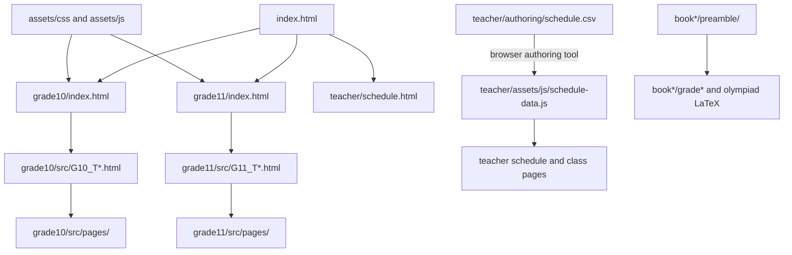

# Repository Structure

## 1. Overview

This repository is a collection of browser-delivered study resources and printable teaching materials for statistics in global-economics contexts. Its two principal delivery forms are:

- a static HTML/CSS/JavaScript study hub for Grades 10 and 11, with practice pages, interactive diagrams, teacher schedules, and small authoring tools; and
- year-specific LaTeX source collections for worksheets, exams, solutions, catch-up work, and olympiad material.

There is no application framework, package manifest, server, or repository-level build configuration. The web content uses native browser APIs and global JavaScript objects, with selected pages loading third-party browser libraries from CDNs. The document sources use LaTeX, TikZ, and PGFPlots. One standalone Python utility processes exported Excel assessment results.

## 2. High-Level Architecture

The repository separates the published/student-facing HTML hubs (`index.html`, `grade10/`, and `grade11/`), shared browser assets (`assets/`), teacher-facing scheduling material (`teacher/`), printable source material (`book2025-2026/` and `book2026-2027/`), and experimental or specialized pages (`other/`). These areas are related by subject matter, but there is no verified automated conversion between the LaTeX books and the HTML study pages.



The CSV-to-schedule-data arrow describes the workflow stated by the authoring tool and the generated file header. Saving the downloaded artifact into its repository destination is a manual step; no command-line generator is present.

## 3. Repository Tree

```text
.
├── index.html                         # Static landing page linking grade hubs and teacher schedule
├── assets/
│   ├── css/                           # Shared site, schedule, graph, resource, and theme styles
│   ├── js/                            # Shared collapsible-section and math/SVG graph behavior
│   ├── html/                          # Standalone/reference HTML templates and decision-tree content
│   └── interactive/
│       ├── index.html                 # Interactive-template settings editor and tool launcher
│       ├── shared/                    # Common interactive-tool styling
│       ├── template/                  # Configurable quiz runtime, settings, databases, and CSS
│       └── tools/                     # Image-question and spreadsheet-to-question-data authoring tools
├── grade10/
│   ├── index.html                     # Grade 10 landing page
│   └── src/
│       ├── G10_T1.html                # Term 1 curriculum page
│       ├── G10_T2.html                # Term 2 curriculum page
│       ├── G10_T3.html                # Term 3 curriculum page
│       └── pages/                     # Detailed practice, formula, example, and interactive pages
├── grade11/                           # Grade 11 equivalent of the Grade 10 HTML hub
│   ├── index.html
│   └── src/                           # Three term pages plus topic/practice pages
├── teacher/
│   ├── schedule.html                  # Main teacher weekly-schedule entry point
│   ├── schedule-teacher.html          # Additional teacher resource page
│   ├── authoring/schedule.csv         # Canonical dated schedule authoring input
│   ├── assets/
│   │   ├── css/                       # Teacher schedule-specific presentation
│   │   ├── html/general_calendar.html # Year-calendar view
│   │   └── js/                        # Schedule datasets, renderers, page controllers, and theme state
│   ├── pages/                         # Generic/full/class-specific schedules and supplementary pages
│   └── tools/
│       ├── schedule_authoring_tool.html # Browser CSV validator/artifact generator
│       └── 2026-02-19-results/        # Excel exports and their Python normalization utility
├── book2025-2026/
│   ├── preamble/                      # Shared LaTeX preambles, templates, graph definitions, and images
│   ├── grade10/ and grade11/          # Term-organized printable curriculum sources and CSV datasets
│   ├── grade9/                        # Grade 9 material (currently minimal)
│   ├── olympiad/                      # Olympiad document sources
│   └── clean-latex.bat                # Windows cleanup helper for LaTeX auxiliary files
├── book2026-2027/                     # Next academic-year LaTeX collection with the same broad layout
│   └── olympiad/                      # Also contains Cambridge papers/data and diploma sources
├── other/
│   ├── cambridge/                     # Grade 3 assessment heatmap dashboard, data, CSS, and validator
│   ├── Test Basic/ and Test Codex/    # Standalone quiz/template experiments, not an automated test suite
│   └── src/pages/                     # Standalone Grade 9 correlation page
└── .gitignore                         # Excludes LaTeX PDFs and compiler auxiliary output
```

## 4. Component Relationships

### Student site

- `index.html` is the navigation root. It links to `grade10/index.html`, `grade11/index.html`, and `teacher/schedule.html` and consumes the shared base, component, and theme styles in `assets/css/`.
- Each grade index links to its three term overview files under `grade10/src/` or `grade11/src/`. Term pages, in turn, link to topic-level files in their neighboring `pages/` directory and to externally hosted videos/documents.
- Grade and practice pages reuse styles from `assets/css/`. Pages with collapsible content load `assets/js/collapsible.js`; math-heavy pages configure MathJax with `assets/js/math-render.js` and may use its `window.MathRender` SVG graph API. Dependency loading is page-specific rather than bundled.
- `assets/html/` contains standalone templates/reference content. It is not linked from the root hub in the inspected navigation, so its publishing role is independent or historical.

### Interactive quiz tools

- `assets/interactive/template/template.html` loads, in order, template settings, the multiple-choice database, image-question settings, and `template.js`. These scripts communicate through `window.InteractiveTemplateSettings`, `window.InteractiveMultipleChoiceQuestionSettings`, and related browser globals.
- `assets/interactive/index.html` edits and downloads a replacement `settings.js`. The tools in `assets/interactive/tools/` similarly download JavaScript data files intended for `assets/interactive/template/databases/`. The user must move the downloaded files into place manually.
- The quiz runtime loads jsPDF from a CDN for PDF output; the multiple-choice authoring tool loads SheetJS from a CDN to read CSV/XLS/XLSX files.

### Teacher schedules

- `teacher/schedule.html` renders the weekly table with `teacher/assets/js/render-weekly-schedule-table.js`, then adds schedule interaction and theme behavior. Its class cards link to the ten section pages in `teacher/pages/class_schedules/` and the full schedule.
- The class and full-schedule controllers consume shared data objects from `teacher/assets/js/schedule-data.js`, `schedule-data-base.js`, and `class-data.js`, then delegate display work to schedule renderer scripts. `teacher/assets/html/general_calendar.html` instead consumes `year-calendar-data.js`.
- `teacher/assets/js/schedule-data.js` explicitly identifies itself as generated from `teacher/authoring/schedule.csv`. `teacher/tools/schedule_authoring_tool.html` parses and validates CSV in the browser and offers downloadable flat, normalized, and adapter JavaScript artifacts.
- `teacher/tools/2026-02-19-results/results.py` reads the adjacent class `.xls` exports with pandas, detects student and C1-C10 columns, normalizes four-row student records, and prints or exports cleaned tables. This utility is independent of the schedule runtime.

### Printable books

- Most documents below each `bookYYYY-YYYY/grade*/term_*` directory are individually compilable `.tex` entry points. The numbered subdirectories group practice activities, learning evidence/exams, catch-ups, and extra material.
- Many solution and exam files begin with `\input` of that academic year's `preamble/preamble.tex` or `preamble/preamble_exams.tex`; other documents declare their own class and packages. Shared preambles define layout, math/table packages, navigation helpers, graphics, TikZ/PGFPlots, color, and boxed-content macros.
- `preamble/graphs/` supplies reusable plot definitions, while `preamble/imgs/` and `preamble/logo.png` supply document artwork. CSV datasets beside Term 3 activities are inputs or companion data for statistics exercises; no repository-wide data compilation pipeline is present.
- The two academic-year trees are parallel content collections, not a declared package workspace. They retain separate preambles and assets, so a document normally depends on resources within its own year.

### Specialized content

- `other/cambridge/grade3_heatmap_dashboard.html` combines its sibling CSS, dashboard logic, and static JavaScript dataset. `validate_grade3_heatmap_data.js` executes the data file in a Node VM, checks row/aggregate invariants, and checks required safeguards in the dashboard source.
- Files below `other/Test Basic/` and `other/Test Codex/` are browser quiz examples despite “Test” in their directory names; repository evidence does not configure them as automated regression tests.

## 5. Main Execution or Content Flows

### Static-site navigation and rendering

1. A browser opens `index.html` from a static web host or local HTTP server.
2. The user selects a grade hub, a term file, and then a linked practice/topic page.
3. HTML loads shared CSS and any page-specific JavaScript/CDN libraries directly. There is no build, transpilation, routing layer, or backend request flow.
4. Some resource links leave the repository for SharePoint, YouTube, Canva, or other externally hosted teaching content; availability therefore depends on the external service and, potentially, access permissions.

### Interactive assessment authoring and use

1. The author opens `assets/interactive/index.html` or a tool under `assets/interactive/tools/`.
2. Browser-side validation converts form or spreadsheet input into a downloadable JavaScript settings/database file.
3. The author manually replaces the corresponding file under `assets/interactive/template/`.
4. `assets/interactive/template/template.html` loads those globals and `template.js` builds the assessment interface; jsPDF supports client-side PDF generation.

### Schedule authoring and display

1. Schedule rows are maintained in `teacher/authoring/schedule.csv`.
2. `teacher/tools/schedule_authoring_tool.html` loads or accepts CSV, validates fields and relationships, and produces downloadable JavaScript artifacts.
3. After a manual repository update, teacher pages load the generated/static global datasets and render weekly, daily, per-class, full, or calendar views.
4. Because the authoring tool uses `fetch()` for default files, serving the repository over HTTP is more reliable than opening it with a `file:` URL.

### LaTeX document compilation

1. A contributor selects an individual `.tex` document in a grade/term or olympiad directory.
2. The document either imports a relative shared preamble or declares its own class/packages, then consumes any referenced graphs, images, and datasets.
3. A compatible LaTeX engine produces PDF and auxiliary files. PDFs are intentionally ignored by `.gitignore`; `clean-latex.bat` removes common auxiliary artifacts on Windows.

No CI, deployment manifest, publishing script, or canonical LaTeX command is committed. Static-host deployment and choice of LaTeX engine are therefore not verified.

## 6. Subprojects or Workspaces

| Area | Purpose and entry point | Important internal dependencies | Run/build/publish evidence |
| --- | --- | --- | --- |
| Root/grade study hub | Student navigation from `index.html`; grade entry points are `grade10/index.html` and `grade11/index.html`. | `assets/css/`, `assets/js/`, grade term and practice pages, plus external resources. | Open through a static HTTP server; no build step is defined. |
| Interactive template | Configurable browser assessment at `assets/interactive/template/template.html`; authoring starts at `assets/interactive/index.html`. | Local settings/database globals and CSS; CDN jsPDF/SheetJS where used. | Browser tools generate downloads; installation of artifacts is manual. |
| Teacher scheduling | Weekly entry point `teacher/schedule.html`, with class/full/calendar views. | Data globals and controllers under `teacher/assets/js/`; authoring CSV and browser generator. | Static HTTP serving is sufficient. No automated generation command is committed. |
| Assessment-result utility | Normalize class Excel exports via `teacher/tools/2026-02-19-results/results.py`. | Adjacent `.xls` files; Python `pandas`, an Excel reader (the script recommends `xlrd` for `.xls`), and optional `tabulate`. | Run the script with Python; its CLI help is the authoritative argument reference. |
| 2025-2026 print sources | Academic-year worksheets/exams under `book2025-2026/`. | Same-year `preamble/`, images, graphs, and nearby datasets. | Compile individual LaTeX entry points; exact engine/command is unspecified. |
| 2026-2027 print sources | Successor content under `book2026-2027/`, including Cambridge and diploma material. | Its own copied/evolved preamble and assets, plus Cambridge spreadsheet data. | Same individual-document LaTeX model; exact publishing process is unspecified. |
| Cambridge dashboard | Assessment heatmap at `other/cambridge/grade3_heatmap_dashboard.html`. | Sibling CSS, JavaScript, and dataset. | Static browser page; Node validator is the only explicit automated check. |
| Experiments/standalone resources | Quiz comparisons and Grade 9 page in `other/`. | Mostly self-contained HTML and CDN resources. | No integration or publication workflow is declared. |

These are logical subprojects only. No monorepo/workspace manager declares formal boundaries or dependency versions.

## 7. Configuration and Tooling

- **Web configuration:** HTML files directly specify their stylesheets and scripts. There is no `package.json`, lockfile, bundler config, service worker, or environment-variable use in the inspected repository.
- **Browser dependencies:** Individual pages load MathJax, jsPDF, SheetJS, or other scripts from CDN URLs. Versions are fixed only where included in those URLs; there is no centralized dependency inventory.
- **LaTeX configuration:** `book2025-2026/preamble/` and `book2026-2027/preamble/` contain the shared package imports, document macros, templates, graphs, and branding for their respective years. `preamble_exams.tex` and `template_exams.tex` specialize exam documents; `template_solutions.tex` supports solution formatting.
- **Generated-output policy:** `.gitignore` ignores `.pdf` plus standard LaTeX `.aux`, `.log`, `.toc`, `.out`, `.lof`, `.lot`, and SyncTeX files. Each book has a Windows `clean-latex.bat` cleanup helper.
- **Python tooling:** `results.py` uses `argparse` and pandas. Optional output formatting uses `tabulate`; legacy Excel input needs an appropriate pandas engine such as `xlrd`.
- **Schedule authoring:** `teacher/tools/schedule_authoring_tool.html` is a zero-install browser generator. It expects schedule data and also references slot/class definitions during validation.
- **Secrets and environment:** No environment-variable configuration or secret store was found. External links may point to access-controlled content, but this document does not reproduce credentials or query values.
- **Deployment:** No `.github/workflows/`, container config, hosting manifest, or release script exists. A static host is a reasonable architectural inference from the relative links and client-only implementation, but the actual production host is unknown.

## 8. Tests and Validation

The only explicit automated repository check is:

```bash
node other/cambridge/validate_grade3_heatmap_data.js
```

It validates the Cambridge dataset schema and answer domain, recomputes aggregate counts, and asserts that specific tooltip/missing-value safeguards remain in `grade3_heatmap_dashboard.js`.

Validation also exists inside browser authoring tools:

- `teacher/tools/schedule_authoring_tool.html` validates required schedule columns, dates/weekdays, class and slot references, and collision keys before generating artifacts.
- `assets/interactive/index.html` validates interactive settings before downloading them.
- `assets/interactive/tools/image-questions.html` and `multiple_choice_questions.html` validate author-entered or imported question data before download.

These browser checks are interactive and are not wired into a test runner. There are no unit-test framework files, browser automation suites, LaTeX lint configuration, HTML validation configuration, or CI checks. The sample pages in `other/Test Basic/` and `other/Test Codex/` should be manually inspected rather than treated as executable tests.

## 9. Generated and External Content

- `teacher/assets/js/schedule-data.js` is marked generated from `teacher/authoring/schedule.csv` and should normally be regenerated rather than hand-edited.
- Files downloaded by the interactive authoring tools are generated data/configuration artifacts. Their intended destinations are documented by the tools under `assets/interactive/template/`.
- PDF and LaTeX auxiliary outputs are excluded by `.gitignore` and should not be committed. The academic-year `.tex`, image, graph, CSV, and spreadsheet inputs are source content, not generated output merely because they compile into documents.
- `teacher/tools/2026-02-19-results/*.xls` and `book2026-2027/olympiad/Cambridge/*.xlsx`/`.xls` are externally produced or manually maintained data inputs. They are tracked content; provenance beyond their local usage is not documented.
- `other/cambridge/grade3_heatmap_dashboard_data.js`, schedule/class/calendar JavaScript datasets, and quiz databases are repository-owned browser data rather than vendored libraries.
- Third-party JavaScript is loaded remotely rather than vendored. No dependency, cache, coverage, or compiled-output directory is tracked.

## 10. Open Questions

1. **Deployment target:** no hosting or deployment configuration identifies where or how the static site is published.
2. **Canonical document compiler:** the LaTeX sources use a broad package set, but no README or build script specifies the required distribution, engine, working directory, or compilation command.
3. **Schedule generation completeness:** `teacher/tools/schedule_authoring_tool.html` references `slots.csv`, but no such path exists in the repository. It is unclear whether slot data is intentionally external, obsolete, or missing. The exact manual mapping from each downloaded generated artifact to current runtime files is also not fully documented.
4. **Academic-year lifecycle:** the relationship between `book2025-2026/` and `book2026-2027/` appears to be copy-forward/evolution, but there is no documented migration or archival policy.
5. **Standalone content publication:** repository navigation does not establish whether `assets/html/` and most of `other/` are published entry points, reference templates, or retained experiments.

