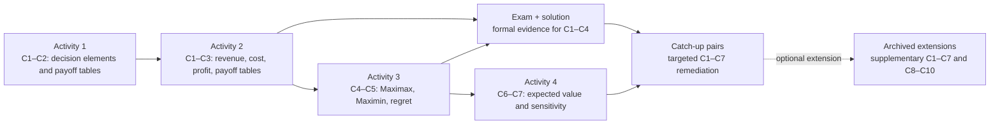
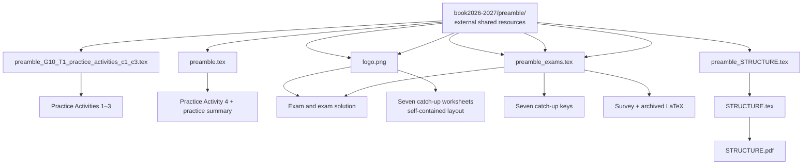

# Grade 10 Global Economics — Term 1

## Overview

This directory contains the Grade 10 Term 1 decision-analysis materials. The instructional sequence moves from describing decisions under uncertainty and constructing payoff tables (C1–C3), through optimistic/conservative, regret, expected-value, and sensitivity methods (C4–C7), to archived extension work on Bayes comparisons and decision trees (C8–C10). It includes student practice, one formal assessment and its key, criterion-specific catch-up worksheets and keys, supplementary/archived material, and documentation sources.

The numbered folders reflect intended use rather than a build pipeline: `1-practice_activities/` develops skills, `2-learning_evidences/` checks them, `3-catch_ups/` remediates individual criteria, and `4-extra_material/` provides a survey plus older supplementary resources. Most documents are standalone LaTeX entry points but rely on shared preambles or a logo stored **outside** this directory under `book2026-2027/preamble/`.

## Directory tree

Paths below are relative to `book2026-2027/grade10/term_1/`.

```text
.
├── README.md
├── STRUCTURE.md
├── STRUCTURE.pdf
├── STRUCTURE.tex
├── 1-practice_activities/
│   ├── G10_T1_L1_C1C2_practice_activity1-alternate-descriptions.tex
│   ├── G10_T1_L1_C1C2_practice_activity1.tex
│   ├── G10_T1_L1_C1C3_practice_activity2-alternate-descriptions.tex
│   ├── G10_T1_L1_C1C3_practice_activity2.tex
│   ├── G10_T1_L2_C4C5_practice_activity3.tex
│   ├── G10_T1_L2_C6C7_practice_activity4.tex
│   └── G10_T1_practice_activities_summary.tex
├── 2-learning_evidences/
│   ├── G10_T1_L1_C1C2C3C4_exam.tex
│   └── G10_T1_L1_C1C2C3C4_exam_solution.tex
├── 3-catch_ups/
│   ├── G10_T1_C1_catchUp.tex
│   ├── G10_T1_C1_catchUp_soution.tex
│   ├── G10_T1_C2_catchUp.tex
│   ├── G10_T1_C2_catchUp_soution.tex
│   ├── G10_T1_C3_catchUp.tex
│   ├── G10_T1_C3_catchUp_soution.tex
│   ├── G10_T1_C4_catchUp.tex
│   ├── G10_T1_C4_catchUp_soution.tex
│   ├── G10_T1_C5_catchUp.tex
│   ├── G10_T1_C5_catchUp_solution.tex
│   ├── G10_T1_C6_catchUp.tex
│   ├── G10_T1_C6_catchUp_soution.tex
│   ├── G10_T1_C7_catchUp.tex
│   └── G10_T1_C7_catchUp_solution.tex
└── 4-extra_material/
    ├── G10_T1_survey.tex
    └── old/
        ├── G10_T1_L1_V2_solution.tex
        ├── G10_T1_L1_supplementary.tex
        ├── G10_T1_L1_supplementary_hard_solution.tex
        ├── G10_T1_L1_supplementary_solution.tex
        ├── G10_T1_L2_C6_activity_supplementary.tex
        ├── G10_T1_L2_C6_activity_supplementary_solution.tex
        ├── G10_T1_L2_MATERIAL.tex
        ├── G10_T1_L2_reference_midterm.tex
        └── G10_T1_L3_MATERIAL.tex
```

## Learning-criteria map

The wording varies slightly among documents, but the files collectively use the following progression:

| Criterion | Skill represented in the materials |
|---|---|
| C1 | Characterise/formulate a decision under uncertainty; identify its alternatives, states, consequences, and context. Some older recovery material also places expected-value evaluation under C1. |
| C2 | Interpret and organise alternatives, events, consequences, states of nature, and supplied payoffs in a payoff table. |
| C3 | Calculate profit from revenue, variable/fixed components, and quantities, then construct a payoff table. |
| C4 | Apply Maximax and Maximin to make optimistic or conservative choices without probabilities. |
| C5 | In the current Practice Activity 3, construct opportunity-loss tables and use Minimax Regret; the separate C5 catch-up instead labels C5 as Maximin. This inconsistency exists in the source materials. |
| C6 | Use probabilities/expected value in Practice Activity 4; the catch-up and archived Lesson 2 files instead describe C6 as maximum opportunity/Minimax Regret. |
| C7 | Analyse decisions with probabilities and expected value, including sensitivity to probabilities. |
| C8–C10 | Archived Lesson 3 extension: compare Bayes, Maximin, and Minimax Regret (C8), build decision trees (C9), and perform end-to-end evaluation (C10). |

## Folder summaries and file catalogue

### `1-practice_activities/`

**Purpose.** The main teaching/practice sequence. It progresses from identifying the components of a decision and calculating payoffs to applying decision criteria. The first four activity sources are unusually detailed worked instructional documents rather than blank worksheets; the alternate-description files provide more concise parallel narratives for the same activity structures. The summary is a contributor/teacher map of the set.

**Contents and relationship.** All seven files are LaTeX sources. Activities 1–3 import the shared `preamble_G10_T1_practice_activities_c1_c3.tex`; Activity 4 and the summary import the general `preamble.tex`. Both preambles live in `book2026-2027/preamble/`, not here. No activity imports another activity and there are no local graph/image files.

| File | Type/classification | Purpose, topics, and relationships |
|---|---|---|
| `G10_T1_L1_C1C2_practice_activity1.tex` | LaTeX; worked practice/source | Full C1–C2 activity on alternatives, events, consequences, states, and payoff-table construction. It begins with introductory and advanced general models, then systematically covers direct payoffs and one-, two-, three-, and four-component payoff models (alternative/state variable and fixed components) across many economic contexts. Imports the shared practice preamble. |
| `G10_T1_L1_C1C2_practice_activity1-alternate-descriptions.tex` | LaTeX; alternate practice source | Concise parallel/alternate descriptions for Activity 1. It preserves the direct through four-component model taxonomy and the same C1–C2 purpose but contains shorter scenario treatments rather than the full workings. Imports the same shared practice preamble; it is an alternative version, not a dependency of the full activity. |
| `G10_T1_L1_C1C3_practice_activity2.tex` | LaTeX; worked practice/source | Full C1–C3 activity on revenue, costs, profit, and payoff tables. General examples lead into direct, one-, two-, three-, and complete four-component models in contexts including cafés, energy, printing, events, farming, catering, training, delivery, solar installation, cold storage, manufacturing, automation, and EV charging. Imports the shared practice preamble. |
| `G10_T1_L1_C1C3_practice_activity2-alternate-descriptions.tex` | LaTeX; alternate practice source | Shorter alternate descriptions matching Activity 2's structure and named contexts. Supports the same C1 interpretation and C3 calculation/table skills; it is a parallel version, not included by the main file. Imports the shared practice preamble. |
| `G10_T1_L2_C4C5_practice_activity3.tex` | LaTeX; worked practice/solutions | Titled as C4–C5 “Solutions.” It explains and works general and contextual payoff matrices of increasing dimensions (`2×2` through `3×4`/`4×3`). C4 applies Maximax and Maximin; C5 builds opportunity-loss tables and applies Minimax Regret. Imports the shared practice preamble. |
| `G10_T1_L2_C6C7_practice_activity4.tex` | LaTeX; practice/source with worked analysis | C6 expected-value choices for theater ticketing, holiday inventory, and routing, followed by C7 sensitivity analysis for marketing, production, and zoning decisions. Imports the external general `preamble.tex`. It continues the decision-rule sequence after Activity 3. |
| `G10_T1_practice_activities_summary.tex` | LaTeX; supporting teacher/contributor summary | Describes the coverage and progression of all four current practice activities, including their scenario/model groupings. Imports external `preamble.tex`; it documents the activities but is not loaded by them. |

### `2-learning_evidences/`

**Purpose.** Formal evidence of learning for C1–C4. The folder contains exactly one student exam and its teacher solution; it does not currently contain the broader Lesson 1–3 assessment collection described by the older `STRUCTURE.*` files.

**Contents and relationship.** Both are standalone LaTeX entry points using external `preamble_exams.tex`. The student exam also resolves `logo.png` through its search paths; both resources are under `book2026-2027/preamble/`.

| File | Type/classification | Purpose, topics, and relationships |
|---|---|---|
| `G10_T1_L1_C1C2C3C4_exam.tex` | LaTeX; student assessment | Six-problem exam. Weekend market and urban delivery assess decision characterisation/table construction (C1–C2); school lunch and cold-chain distribution assess profit/payoff construction (C1–C3); mobile produce and warehouse technology assess Maximax/Maximin (C4). It imports the exam preamble and embeds the external logo. Despite its header saying “3 TERM” and `2025–2026`, its stored location/name is Term 1 for 2026–2027; this README reports the file as stored rather than correcting its content. |
| `G10_T1_L1_C1C2C3C4_exam_solution.tex` | LaTeX; teacher solution | Complete companion key for the six exam contexts, with decision elements, tables/calculations, and Maximax/Maximin workings and point allocations. Imports the external exam preamble; it does not include the exam source directly. |

### `3-catch_ups/`

**Purpose.** Criterion-by-criterion recovery/remediation for C1–C7. Each student worksheet has a corresponding teacher key. Each pair contains ten problems; solution documents generally provide full workings plus a “Minimal Solutions” section.

**Contents and relationship.** Student sheets define their own `article` layout and packages and embed `../../../preamble/logo.png`. Keys import `../../../preamble/preamble_exams.tex`. The misspelling `soution` is part of five actual filenames and is preserved below. No key programmatically imports its worksheet.

| Student file | Solution file | Type and content |
|---|---|---|
| `G10_T1_C1_catchUp.tex` | `G10_T1_C1_catchUp_soution.tex` | LaTeX recovery worksheet + teacher key. C1 formulates choices under uncertainty and evaluates expected values; ten progressively varied decision problems receive full and concise answers. |
| `G10_T1_C2_catchUp.tex` | `G10_T1_C2_catchUp_soution.tex` | LaTeX recovery worksheet + teacher key. C2 identifies/interprets alternatives, uncertain events, consequences, and states of nature in ten scenarios. |
| `G10_T1_C3_catchUp.tex` | `G10_T1_C3_catchUp_soution.tex` | LaTeX recovery worksheet + teacher key. C3 converts supplied or calculated revenue/cost/profit data into payoff tables, including fixed-plus-variable and multi-component cases. |
| `G10_T1_C4_catchUp.tex` | `G10_T1_C4_catchUp_soution.tex` | LaTeX recovery worksheet + teacher key. C4 applies the optimistic Maximax rule to payoff tables without probabilities; the key identifies row maxima and recommended choices. |
| `G10_T1_C5_catchUp.tex` | `G10_T1_C5_catchUp_solution.tex` | LaTeX recovery worksheet + teacher key. C5 applies conservative Maximin without probabilities; the key shows row minima and recommendations. |
| `G10_T1_C6_catchUp.tex` | `G10_T1_C6_catchUp_soution.tex` | LaTeX recovery worksheet + teacher key. C6 uses maximum opportunity/Minimax Regret; the key constructs regret tables and selects the smallest maximum regret. |
| `G10_T1_C7_catchUp.tex` | `G10_T1_C7_catchUp_solution.tex` | LaTeX recovery worksheet + teacher key. C7 uses probabilities and expected value in ten cases ranging from single projects and technology upgrades to policy, marketing, retail, and portfolio choices. |

### `4-extra_material/`

**Purpose.** Non-core support material. The top level contains a student survey; `old/` preserves earlier supplementary assessments, solutions, reference sets, and higher-criterion Lesson 3 material. “Old” indicates archival placement, not that the files are generated or safe to delete.

| File | Type/classification | Purpose, topics, and relationships |
|---|---|---|
| `G10_T1_survey.tex` | LaTeX; supporting student survey | A 21-item, two-column Global Economics intake/profile survey. It collects numerical background/lifestyle responses, ranked career/activity/learning preferences, open reflections, and an optional drawing. It is not a decision-analysis assessment. It imports external `preamble_exams` and additionally loads TikZ to draw answer boxes. |

#### `4-extra_material/old/`

All nine archived files are LaTeX sources. Each imports `../../preamble/preamble_exams.tex` as written. Because these paths are relative and compilation conventions can affect resolution, users should verify the build working directory; the shared preamble actually present in the repository is `book2026-2027/preamble/preamble_exams.tex`.

| File | Type/classification | Purpose, topics, and relationships |
|---|---|---|
| `G10_T1_L1_V2_solution.tex` | LaTeX; alternate teacher solution | An alternate C1–C5 solution set with full and minimal answers. It covers interpreting decisions, payoff calculations/tables, Maximax, Maximin, and expected value. It is a versioned/parallel key and has no matching `V2` student source in this directory. |
| `G10_T1_L1_supplementary.tex` | LaTeX; student supplementary assessment | Five C1–C5 problems on smoothie menus, fundraiser T-shirts, streaming bundles, courier routes, and water-treatment mixes. It is directly paired with `G10_T1_L1_supplementary_solution.tex`. |
| `G10_T1_L1_supplementary_solution.tex` | LaTeX; teacher solution | Full and minimal answers for the standard five-problem supplementary assessment, including decision elements, payoff calculations, decision rules, and expected values. |
| `G10_T1_L1_supplementary_hard_solution.tex` | LaTeX; teacher extension solution | A harder parallel C1–C5 worked set with more complex alternatives/joint states. It is not the direct key to the standard student supplementary sheet, and no matching hard student source is stored here. |
| `G10_T1_L2_C6_activity_supplementary.tex` | LaTeX; student supplementary assessment | Seven C6 Minimax Regret problems: cafeteria supply, bookstore inventory, battery storage, sports programming, recycling outreach, tourism packages, and bus scheduling. |
| `G10_T1_L2_C6_activity_supplementary_solution.tex` | LaTeX; teacher solution | Direct key to the seven C6 supplementary problems, showing state maxima, regret calculations/tables, and Minimax Regret selections, followed by minimal answers. |
| `G10_T1_L2_MATERIAL.tex` | LaTeX; worked teacher/instructional material | Combined Lesson 2 set: four C6 maximum-opportunity/Minimax Regret examples with cross-rule comparisons, then ten C7 probability/expected-value examples. It is a reusable worked reference rather than a blank worksheet. |
| `G10_T1_L2_reference_midterm.tex` | LaTeX; teacher reference solutions | Worked C1–C7 reference set covering café/cafeteria, logistics, investment, production, and bookstore decisions, including payoff construction, classical rules, expected value, and regret. It is not paired with a blank midterm in the current directory. |
| `G10_T1_L3_MATERIAL.tex` | LaTeX; worked extension/teacher material | Lesson 3 C8–C10 material: Bayes vs. Maximin vs. Minimax Regret on common datasets, staged decision trees/filtering (C9), and full end-to-end analyses (C10). It is the only current file covering C8–C10. |

### Root documentation and generated documentation

| File | Type/classification | Purpose, content, and relationships |
|---|---|---|
| `README.md` | Markdown; current supporting documentation | This inventory. It is the authoritative current map of the physical contents and logical relationships under `term_1/`. |
| `STRUCTURE.md` | Markdown; older supporting inventory | A previous directory description. Its overview remains useful background, but its tree names many assessment/project files that are no longer present and uses older filenames for practice material; therefore it is not an accurate current inventory. It corresponds conceptually to `STRUCTURE.tex`. |
| `STRUCTURE.tex` | LaTeX; older documentation source | Typeset source for the older structure inventory. It imports external `../../preamble_STRUCTURE.tex`. Like `STRUCTURE.md`, its enumerated tree is stale relative to the current directory. |
| `STRUCTURE.pdf` | PDF; generated documentation artifact | Compiled/typeset form of the older structure document (a reusable/viewable binary artifact associated with `STRUCTURE.tex`). It should not be treated as evidence that the obsolete filenames it describes still exist. |

## Workflows and dependencies

### Instructional flow



This is a logical teaching relationship; the LaTeX files do not include one another.

### Student/teacher pairs

```text
2-learning_evidences/
└── G10_T1_L1_C1C2C3C4_exam.tex
    └── teacher key: G10_T1_L1_C1C2C3C4_exam_solution.tex

3-catch_ups/
├── G10_T1_C1_catchUp.tex ── key: G10_T1_C1_catchUp_soution.tex
├── G10_T1_C2_catchUp.tex ── key: G10_T1_C2_catchUp_soution.tex
├── G10_T1_C3_catchUp.tex ── key: G10_T1_C3_catchUp_soution.tex
├── G10_T1_C4_catchUp.tex ── key: G10_T1_C4_catchUp_soution.tex
├── G10_T1_C5_catchUp.tex ── key: G10_T1_C5_catchUp_solution.tex
├── G10_T1_C6_catchUp.tex ── key: G10_T1_C6_catchUp_soution.tex
└── G10_T1_C7_catchUp.tex ── key: G10_T1_C7_catchUp_solution.tex

4-extra_material/old/
├── G10_T1_L1_supplementary.tex
│   └── direct key: G10_T1_L1_supplementary_solution.tex
│       (the `hard_solution` and `V2_solution` files are parallel keys, not direct matches)
└── G10_T1_L2_C6_activity_supplementary.tex
    └── direct key: G10_T1_L2_C6_activity_supplementary_solution.tex
```

### LaTeX build resources



Important build details:

* There are no reusable graphs, standalone images, bibliography files, datasets, JavaScript files, or configuration files physically stored under `term_1/`. Diagrams/tables are authored in LaTeX; the survey uses TikZ directly.
* Practice sources use an `\input@path` search list to locate their external preambles. The exam uses a similar search list for `preamble_exams.tex` and `logo.png`.
* Catch-up student sheets are largely self-contained but depend on the external logo; catch-up keys depend on the external exam preamble.
* The archived files' written `../../preamble/...` path and `STRUCTURE.tex`'s `../../preamble_STRUCTURE.tex` require attention to compilation location/path resolution. No local preamble substitutes exist under `term_1/`.
* `STRUCTURE.pdf` is the only PDF in this tree. No `.aux`, `.log`, `.out`, or `.toc` build by-products are stored here.

## Material classification at a glance

* **Source/instructional material:** the four main practice activities, their alternate-description variants, archived `MATERIAL`/reference sources, and all LaTeX entry points.
* **Practice activities:** everything in `1-practice_activities/` except its summary; the supplementary student sheets in `4-extra_material/old/` provide optional additional practice/assessment.
* **Solutions/teacher material:** the exam solution, all catch-up `solution`/`soution` files, archived solution/reference/material files, and the practice summary.
* **Assessments:** the exam in `2-learning_evidences/`, the criterion catch-ups, and archived supplementary assessments. The survey is support material, not an assessment of Term 1 economics criteria.
* **Reusable assets:** none local. Shared preambles and `logo.png` are external dependencies under `book2026-2027/preamble/`.
* **Supporting/generated files:** this README, the older `STRUCTURE.md`/`STRUCTURE.tex` inventory pair, and its compiled `STRUCTURE.pdf`.

