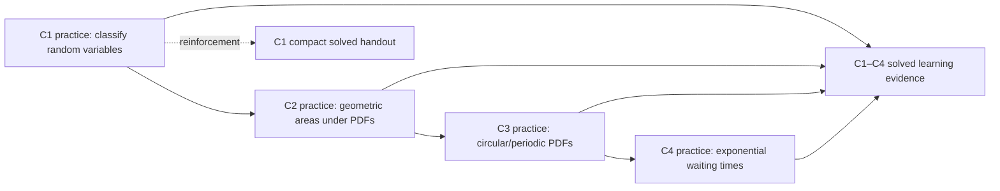
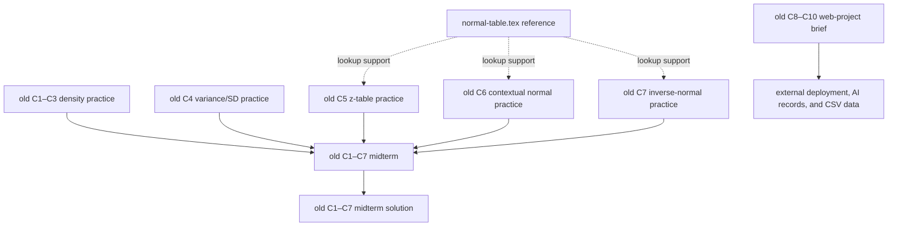
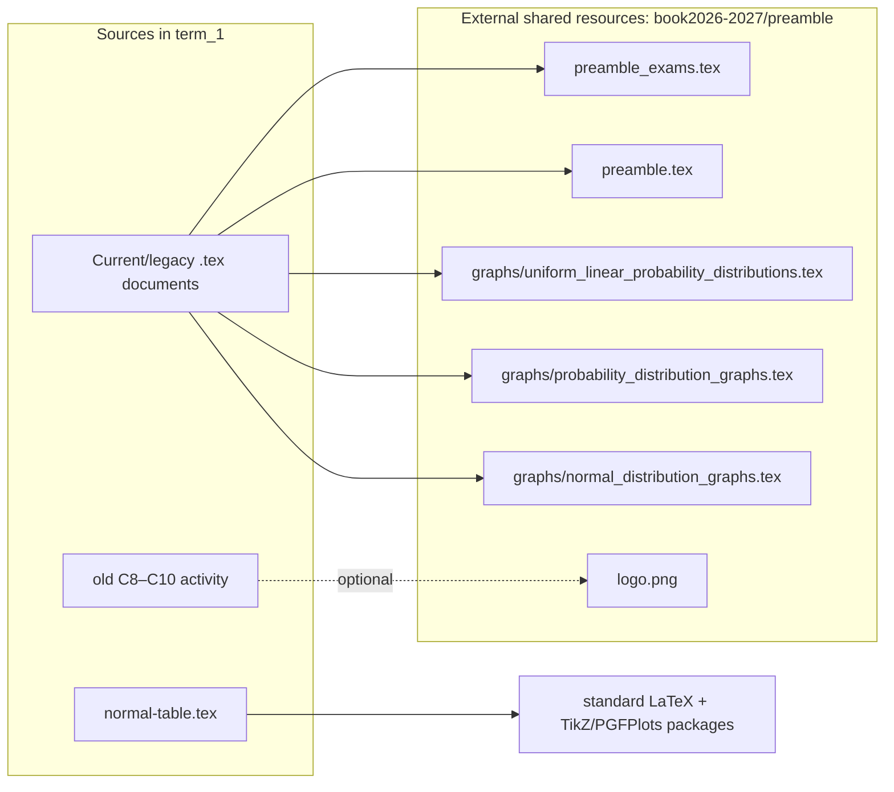

# Grade 11 — Term 1 materials

This directory is the working collection for Grade 11 Term 1 probability. Its current sequence introduces and classifies random variables (C1), calculates areas under constant and piecewise-linear densities (C2), treats periodic variables with circular geometry (C3), and models constant-rate waiting times with the exponential distribution (C4). It contains current worked practice, a cumulative solved learning evidence, supplementary print/reference sheets, and clearly named `old_` resources retained from an earlier Term 3 sequence.

All paths below are relative to `book2026-2027/grade11/term_1/`. Every instructional document is LaTeX source (`.tex`); no generated PDFs are stored here.

## Complete directory tree

```text
.
├── README.md
├── 1-practice_activities
│   ├── G11_T1_C1_practice_activity1.tex
│   ├── G11_T1_C2_practice_activity2.tex
│   ├── G11_T1_C3_practice_activity3.tex
│   ├── G11_T1_C4_practice_activity4.tex
│   ├── old_G11_T3_C1C2C3_practice_activity_context.tex
│   ├── old_G11_T3_C4_practice_activity.tex
│   ├── old_G11_T3_C5_practice_activity.tex
│   ├── old_G11_T3_C6_practice_activity.tex
│   └── old_G11_T3_C7_practice_activity.tex
├── 2-learning_evidences
│   ├── G11_T1_C1C2C3C4_exam0_solution.tex
│   ├── old_G11_T3_C1C7_midterm.tex
│   ├── old_G11_T3_C1C7_midterm_solution.tex
│   └── old_G11_T3_L4_C8C9C10_activity.tex
└── 4-extra_material
    ├── G11_T1_C1_practice_activity1_print1_solved.tex
    └── normal-table.tex
```

The numbering deliberately has no `3-*` folder in the present tree. `old_` means legacy material physically retained here; it should not be mistaken for the current C1–C4 sequence merely because it remains buildable.

## Folder roles and instructional sequence

| Folder | Role and contents | Relationship to the rest of Term 1 |
|---|---|---|
| `1-practice_activities/` | **Practice/source materials.** Four current, self-contained activities with explanations, contextual problems, and worked solutions; five legacy activities covering the former C1–C7 progression. | The current C1–C4 files prepare learners for `2-learning_evidences/G11_T1_C1C2C3C4_exam0_solution.tex`. Several documents load graph macros maintained outside this directory. |
| `2-learning_evidences/` | **Assessments and solutions.** One current cumulative C1–C4 solved exercise set, a legacy C1–C7 midterm and its solution, and a legacy C8–C10 web-project brief. | Assesses or extends the skills practiced in `1-practice_activities/`. The legacy midterm pair is a direct question/solution workflow. The project brief is independent of the current assessment and refers to external web resources and datasets. |
| `4-extra_material/` | **Supplementary/reference materials.** A compact solved C1 classification handout and a standalone standard-normal table. | The handout reinforces the current C1 activity. The normal table supports normal-probability work in the legacy C5–C7 materials, but is not imported by them. |

Recommended current teaching order:



## Current Term 1 files

### Practice activities

#### `1-practice_activities/G11_T1_C1_practice_activity1.tex`

- **Type/status:** LaTeX instructional practice activity **with solutions**.
- **Purpose/content:** Introduces random variables, support, PMFs, PDFs, CDFs, and the distinction between discrete and continuous variables. It gives recognition rules and formulas for Bernoulli, binomial, geometric, Poisson, uniform, triangular, linear, and normal distributions, followed by Colombian economic/business classification cases in discrete and continuous groups.
- **Criterion:** C1—characterise continuous variables, distinguish them from discrete variables, and interpret PDF, CDF, and support in economic contexts.
- **Dependencies:** Loads shared `preamble_exams.tex` and the reusable macro libraries `graphs/uniform_linear_probability_distributions.tex`, `graphs/probability_distribution_graphs.tex`, and `graphs/normal_distribution_graphs.tex`. These are external Term 1 dependencies found through the document's multi-level `\input@path`, under `book2026-2027/preamble/`.
- **Relationships:** Establishes vocabulary needed by C2–C4, is assessed in the cumulative solution file, and has a shorter classification-only companion in `4-extra_material/`.

#### `1-practice_activities/G11_T1_C2_practice_activity2.tex`

- **Type/status:** LaTeX instructional practice activity **with solutions**.
- **Purpose/content:** Teaches an eight-step modeling routine: define the variable and support, infer the density shape, normalize total area to one, write a complete PDF, and calculate/interpret interval areas. Worked and contextual sections cover uniform, one-line linear, triangular, piecewise-uniform, and piecewise-linear distributions using rectangles, triangles, trapezoids, complements, and continuity/breakpoints.
- **Criterion:** C2—apply uniform and triangular continuous distributions with constant or piecewise-linear PDFs to calculate interval probabilities geometrically.
- **Dependencies:** Loads `preamble_exams.tex` plus all three external graph libraries named for C1 above. It uses their probability-density graph commands to visualize and shade regions.
- **Relationships:** Applies C1's PDF/support concepts and feeds the C2 portion of the cumulative learning evidence.

#### `1-practice_activities/G11_T1_C3_practice_activity3.tex`

- **Type/status:** LaTeX instructional practice activity **with solutions**.
- **Purpose/content:** Develops probability for periodic variables: a normalized quarter-circle/semicircular-arc density, intervals crossing zero, circular means for directions near a cycle boundary, resultant-vector concentration, time-of-day circular probability, and choosing circular versus ordinary linear models.
- **Criterion:** C3—apply probability distributions for periodic variables, calculate probabilities with circular geometry, and interpret circular means/concentration (the criterion text spans multiple source lines).
- **Dependencies:** Loads only the external shared `preamble_exams.tex`; its mathematical diagrams/geometry are implemented within the document rather than through an imported graph file.
- **Relationships:** Extends continuous-density area reasoning from C2 and supplies the circular-arc tasks in the cumulative C1–C4 solution set.

#### `1-practice_activities/G11_T1_C4_practice_activity4.tex`

- **Type/status:** LaTeX instructional practice activity **with solutions**.
- **Purpose/content:** Connects a constant Poisson event rate to exponential waiting time; converts rate units; calculates below/above/between probabilities and expected waits; uses memorylessness and conditional waiting; and evaluates when changing rates, schedules, queues, or dependence make a single exponential model unsuitable. Contexts include fintech enquiries, couriers, tourism, flower logistics, and digital-wallet alert thresholds.
- **Criterion:** C4—apply the exponential distribution to constant-rate waiting-time situations and assess suitability.
- **Dependencies:** Loads only external `preamble_exams.tex`; no separate graph source is imported.
- **Relationships:** Builds on C1's Poisson recognition and completes the skills assessed by the cumulative C1–C4 file.

### Current solved assessment/resource

#### `2-learning_evidences/G11_T1_C1C2C3C4_exam0_solution.tex`

- **Type/status:** LaTeX **assessment-style practice exercise and complete solution set** (despite the internal title saying “Term 3,” its filename and criteria align with the current Term 1 C1–C4 collection).
- **Purpose/content:** A cumulative scored set. C1 classifies Bernoulli, geometric, Poisson, uniform, triangular, linear, normal, and piecewise continuous cases; C2 normalizes uniform/triangular PDFs and finds geometric probabilities; C3 normalizes circular-arc densities and finds areas using semicircles/circular segments; C4 obtains exponential rates, waiting probabilities/expectations, and judges model suitability.
- **Criteria:** The full current C1–C4 criteria stated in the four practice files.
- **Dependencies:** Loads external `preamble_exams.tex`, `graphs/uniform_linear_probability_distributions.tex`, and `graphs/probability_distribution_graphs.tex`; it does **not** load the normal graph library.
- **Relationships:** Culminating worked evidence for all four current activities. Solutions are embedded in this one file; there is no separate unsolved current exam file in this directory.

#### `4-extra_material/G11_T1_C1_practice_activity1_print1_solved.tex`

- **Type/status:** LaTeX **compact print handout with solutions**; page style is empty and it has no table of contents.
- **Purpose/content:** Ten economic contexts followed by a solution table classifying each variable as discrete/continuous and Bernoulli, uniform, binomial, Poisson, triangular, geometric, linear, or normal. It focuses on distribution recognition rather than calculations.
- **Criterion/concepts:** Supports C1 classification across the same family of distributions as the full C1 activity.
- **Dependencies:** Loads `preamble_exams.tex` and all three external graph libraries, although this short source does not call graph macros directly; the imports make the preamble environment consistent with the full activity.
- **Relationships:** Printable reinforcement/answer key for `G11_T1_C1_practice_activity1.tex`, not a separate assessment.

#### `4-extra_material/normal-table.tex`

- **Type/status:** Standalone LaTeX **reference sheet/supporting asset** with its own `article` document class and package configuration; it does not use a shared preamble.
- **Purpose/content:** Defines `Z ~ N(0,1)`, explains how to read `Phi(z)=P(Z<z)`, demonstrates `Phi(1.23)=0.8907`, lists complement/symmetry/interval/two-tail identities, draws a shaded standard-normal curve in local TikZ/PGFPlots, and tabulates cumulative values for positive `z` from 0.00 through 2.99.
- **Dependencies:** Uses standard LaTeX packages including TikZ and PGFPlots (`compat=1.18`, `fillbetween`); all graph code and data are embedded. No Term 1 file imports it programmatically.
- **Relationships:** A printable lookup aid conceptually paired with legacy C5 standard-normal probabilities, C6 contextual standardisation, and C7 inverse-normal work.

## Legacy practice files retained in this folder

These sources are explicitly prefixed `old_` and identify themselves as Term 3 resources. They are documented because they remain part of the physical Term 1 tree, not because they define the current sequence.

#### `1-practice_activities/old_G11_T3_C1C2C3_practice_activity_context.tex`

- **Type/status:** LaTeX legacy **practice activity with worked responses**.
- **Purpose/content:** Economic investment contexts for C1 continuous density functions, C2 mixtures of uniform scenario distributions, and C3 asymmetric triangular/linear behavior. Tasks derive normalization constants/PDFs, compute loss/earnings and interval probabilities, and compare scenarios. It defines several PGFPlots graph macros locally.
- **Dependencies:** External `preamble_exams.tex`; PGFPlots 1.18. No graph library is imported because reusable-looking graph commands are embedded in this source.

#### `1-practice_activities/old_G11_T3_C4_practice_activity.tex`

- **Type/status:** LaTeX legacy **practice/reference activity with solutions**.
- **Purpose/content:** Interprets expectation, variance, and standard deviation for uniform, triangular, and normal distributions; compares spreads and works symbolically/numerically with parameters. Numerous local TikZ/PGFPlots commands shade and label means and one-standard-deviation regions.
- **Criterion:** Former C4—interpret variance and standard deviation of a probability function.
- **Dependencies:** External `preamble.tex` (not `preamble_exams.tex`) plus PGFPlots 1.18; graph macros are local.

#### `1-practice_activities/old_G11_T3_C5_practice_activity.tex`

- **Type/status:** LaTeX legacy **standard-normal practice with solutions**.
- **Purpose/content:** Explains reading a positive-z cumulative table and using symmetry/complements, then covers left tails, right tails, central bands, and unions of tails for positive and negative bounds. A standard-normal table is embedded in the file.
- **Criterion:** Former C5—use the standard normal distribution/table for contextual probabilities.
- **Dependencies:** External `preamble_exams.tex` and `graphs/normal_distribution_graphs.tex` for shaded curve macros. `4-extra_material/normal-table.tex` is a related reference, not an `\input` dependency.

#### `1-practice_activities/old_G11_T3_C6_practice_activity.tex`

- **Type/status:** LaTeX legacy **contextual normal-distribution practice with worked solutions**.
- **Purpose/content:** Standardises contextual normal variables with `z=(x-mu)/sigma` and calculates left/right tails, intervals, and two-region probabilities for scores, delivery times, weights, app use, commutes, sales, battery life, and heights. It embeds a partial z-table.
- **Criterion:** Former C6—use normal distributions in contextual situations.
- **Dependencies:** External `preamble_exams.tex` and `graphs/normal_distribution_graphs.tex`.

#### `1-practice_activities/old_G11_T3_C7_practice_activity.tex`

- **Type/status:** LaTeX legacy **inverse-normal practice with solutions**.
- **Purpose/content:** Converts percentile/tail statements into cumulative probabilities and uses inverse-normal z-values to find cutoffs or central intervals. Its ten contexts include exam scores, commute times, battery life, streaming speed, plant height, delivery, run times, product lifetime, manufacturing tolerances, and chemistry scores; a z-table is embedded.
- **Criterion:** Former C7—use inverse-normal reasoning to find values and intervals.
- **Dependencies:** External `preamble_exams.tex` and `graphs/normal_distribution_graphs.tex`.

## Legacy learning evidences retained in this folder

#### `2-learning_evidences/old_G11_T3_C1C7_midterm.tex`

- **Type/status:** LaTeX legacy **unsolved midterm assessment/task sheet**, internally labeled Grade 10, Term 3, 2025–2026.
- **Purpose/content:** Two-column scored assessment of former C1–C7: increasing density for coffee investment; a mixture of three uniform inventory scenarios; asymmetric triangular investment; drawing/comparing distributions; standard-normal table calculations; contextual normal standardisation; and inverse-normal cutoffs.
- **Dependencies:** External `preamble_exams.tex`; `logo.png` via `\includegraphics` and a multi-level `\graphicspath` (resolved from the shared preamble area); PGFPlots 1.18 and `enumitem` configured locally.
- **Relationships:** Question paper paired directly with `old_G11_T3_C1C7_midterm_solution.tex`.

#### `2-learning_evidences/old_G11_T3_C1C7_midterm_solution.tex`

- **Type/status:** LaTeX legacy **midterm solution/answer key**, internally labeled Grade 10 Term 3.
- **Purpose/content:** Fully worked solutions to the preceding assessment: normalized PDFs, geometric and normal probabilities, graph interpretation/comparison, standardisation, and inverse-normal cutoff computations.
- **Dependencies:** External `preamble.tex` plus all three shared graph libraries: `uniform_linear_probability_distributions.tex`, `probability_distribution_graphs.tex`, and `normal_distribution_graphs.tex`.
- **Relationships:** Mirrors the C1–C7 order and contexts in `old_G11_T3_C1C7_midterm.tex`.

#### `2-learning_evidences/old_G11_T3_L4_C8C9C10_activity.tex`

- **Type/status:** Standalone LaTeX legacy **project/assessment brief**, internally labeled Grade 10 Term 3 Learning Evidence 4; it defines its own preamble and formatting.
- **Purpose/content:** Specifies a web implementation and APA-style report for continuous probability modeling. C8 requires interactive PDFs and shaded below/above/between probabilities for uniform, triangular, linear, piecewise, and normal distributions. C9 requires AI-assisted fitting from uploaded data, parameter estimates, histograms, fitted curves, interpretation, deployment, and visible AI-conversation links. C10 requires a sourced comparative report, screenshots, model probabilities, and conclusions.
- **Dependencies/assets:** Optionally includes `../../../preamble/logo.png` and falls back to a text “Logo” box. It links to Git/GitHub Pages tutorials, three SharePoint datasets, GitHub Pages, and three relative CSV names (`G10_T3_L4_C8C9C10_dataset_1.csv` through `_3.csv`). Those CSVs do **not** exist in `term_1`; repository copies are under `book2026-2027/grade10/term_3/2-learning_evidences/`, so the relative download links are unresolved when compiled here.
- **Relationships:** Independent legacy C8–C10 extension rather than part of the present C1–C4 evidence workflow.

Legacy workflow:



## LaTeX dependency map and build notes



- The shared-preamble documents set `\input@path` to search the working directory and successively higher `preamble/` directories. Compile from a location compatible with that search strategy (commonly the source directory or repository book hierarchy).
- `preamble_exams.tex` supplies the exam-oriented document setup and custom commands used throughout current materials; legacy sources using `preamble.tex` rely on the general shared setup instead.
- The three shared graph files are **reusable assets outside this folder**, not entries omitted from the tree. They provide macros for uniform/linear, general probability-distribution, and normal-distribution figures respectively.
- `normal-table.tex` and the C8–C10 brief are genuinely standalone and do not use either shared preamble. No images, datasets, `.bib` files, generated outputs, or reusable graph files are physically stored inside `term_1`.

## Material-type index

| Category | Files |
|---|---|
| Current source/instructional practice with embedded solutions | `G11_T1_C1_practice_activity1.tex`, `G11_T1_C2_practice_activity2.tex`, `G11_T1_C3_practice_activity3.tex`, `G11_T1_C4_practice_activity4.tex` |
| Current cumulative assessment-style solutions | `G11_T1_C1C2C3C4_exam0_solution.tex` |
| Current supplementary solved practice | `G11_T1_C1_practice_activity1_print1_solved.tex` |
| Reference/supporting resource | `normal-table.tex` |
| Legacy practice/reference with solutions | all five `1-practice_activities/old_*.tex` files |
| Legacy assessment | `old_G11_T3_C1C7_midterm.tex`, `old_G11_T3_L4_C8C9C10_activity.tex` |
| Legacy solution set | `old_G11_T3_C1C7_midterm_solution.tex` |
| Reusable graph/image/data assets physically inside this directory | None; relevant dependencies are external as described above. |
